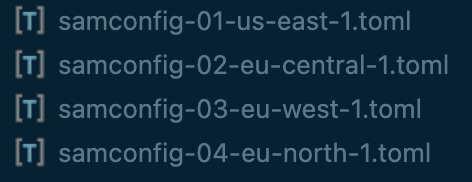
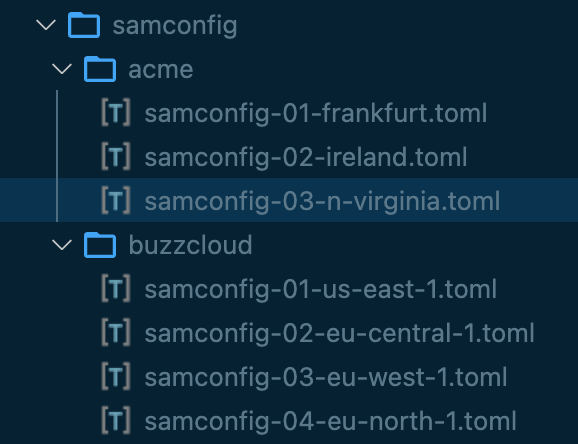

# Automating Forensic Disk Collection

This is a SAM repackaging of Logan Bair's forensic disk collection automation as implemented for Goldman Sachs. The original package is described in this AWS blog post:

- [https://aws.amazon.com/blogs/security/how-to-automate-forensic-disk-collection-in-aws](https://aws.amazon.com/blogs/security/how-to-automate-forensic-disk-collection-in-aws)

You can see and hear Logan describe the background of this solution in the following two videos:

- [https://www.youtube.com/watch?v=CR4_a-TO_gw](https://www.youtube.com/watch?v=CR4_a-TO_gw)
- [https://www.youtube.com/watch?v=W4Ih9zvuBa4](https://www.youtube.com/watch?v=W4Ih9zvuBa4)

This repackaging is functionally identical to the original. However, it is completely self-contained and does not reference any external source code. It can also be installed in multiple regions.

You will need the SAM CLI to manage building and deployment. Installation guides can be found here:

- [https://docs.aws.amazon.com/serverless-application-model/latest/developerguide/serverless-sam-cli-install.html](https://docs.aws.amazon.com/serverless-application-model/latest/developerguide/serverless-sam-cli-install.html) (you can skip Step 3 if you wish)

## Single-Region Installation

If you only will be installing in one region, all you need to do is the following:

1. Navigate to the source folder.
2. Install `diskForensicImageBuilder.yaml` as a stack in your security account in your chosen single region.
3. Using a terminal window, set the AWS account and temporary credential environment variables in your environment. The most convenient way to do this is by copying them from the AWS SSO login page.
4. Enter the command `sam build` to build and package the code.
5. Enter the command `sam deploy --guided`
6. Set the stack name to `diskForensics`.
7. Enter the parameter data. Accept the defaults for creating the configuration file. Be careful to set the capabilities to `CAPABILITY_IAM CAPABILITY_NAMED_IAM`. Both are needed.
8. Next, SAM will deploy the package. You will be able to follow the process in detail in the terminal.
9. When SAM is done, install `diskMember.yaml` as a StackSet in your org account, deploying to all accounts in your chosen region.

The next time you wish to deploy, all you need to do is:

```console
sam build
sam deploy
```

## Multi-Regional Installation

Deploying to multiple regions is done by using multiple TOML files with different names beginning with `samconfig-`. The files will be processed in alphabetical order, so simply name them accordingly, e.g.:



The config file names are not processed in any special way, but you might want to include region information in the name to make it easier for yourself. Cf the above image.

To create this setup, you basically follow the single-region setup instructions. Built as usual using `sam build`, but then add the following switch to the deployment command:

```console
sam deploy --guided --config-file=samconfig-<something>.toml
```

The `<something>` part can, again, be anything you like.

Then, when you have deployed to all of your regions and generated config files for them in the process, the next time you wish to build and deploy, simply do the following:

```console
sam build
./deploy-all
```

The `deploy-all`bash script will find your config files in the project root directory and process them in alphabetical order.

NB: `diskForensicImageBuilder.yaml` must be installed in all the regions you are going to use before this step, and `diskMember` to all accounts in your main region after this step, just as for a single-region installation.

## Multi-System Installation

If you have more than one system or customer, you can create a `samconfig`folder with subfolders named after the separate systems, like this:



This allows you to type

```console
./deploy-all acme
```

or

```console
./deploy-all buzzcloud
```

The appropriate subfolder will be selected and its TOML files processed in alphabetical order. This is actually a good structure to adopt for a single system setup as well, as it keeps the root directory uncluttered.

NB: `diskForensicImageBuilder.yaml` must be installed in all regions you are going to use before this step, and `diskMember` to all accounts in your main region after this step, just as for a single-region installation.

## Activating the Event Rule

SAM, for some curious reason, cannot yet create disabled event rules. Instead, we have modified the pattern of the event rule to always fail any matches. Go to `template.yaml` and search for:

`'REMOVETHISTOENABLESecurity Hub Findings - Imported'`

Change the string to:

`'Security Hub Findings - Imported'`

Then build and redeploy.
